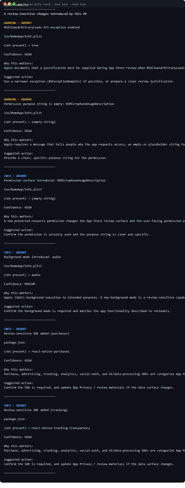

# AppReviewDelta

**Detect iOS release-review risks introduced by a pull request.**

AppReviewDelta is a static, rule-based GitHub Action and CLI that answers one narrow question about every pull request:

> Which new iOS release-review risks or review-sensitive changes did this PR introduce?

It compares **BASE → HEAD** and reports only what a PR newly introduced or materially worsened. If the base branch already contains a problem, AppReviewDelta does not re-report it as new.

```text
AppReviewDelta
──────────────────────────────
6 review-sensitive changes introduced by this PR

WARNING · ARD003
NSAllowsArbitraryLoads ATS exception enabled

ios/DemoApp/Info.plist

(not present) → true

Confidence: HIGH

Why this matters:
Apple documents that a justification must be supplied during App Store
review when NSAllowsArbitraryLoads is YES.

Suggested action:
Use a narrower exception (NSExceptionDomains) if possible, or prepare a
clear review justification.
```



**No target checkout. No project execution. No source upload. No AI key.**

---

## Why this exists

Teams shipping Expo / React Native iOS apps already have whole-project health checks (`npx expo-doctor`, Xcode warnings) and LLM-based "preflight" review skills that scan an entire codebase before submission. What those tools do not do is answer the per-PR question in CI:

- They re-scan everything, so an old problem in `main` reappears as "new" on every pull request.
- They need an agent, an API key, or a human in the loop.

AppReviewDelta is the narrow tool for the gap in between: deterministic, official-source-anchored, **base-to-head differential analysis** that runs on `pull_request` events with read-only permissions. It is designed so the analyzed PR does not need to be checked out or executed — it reads the minimum relevant repository data through GitHub APIs and treats target code as untrusted data.

It is **not**:

- an App Store approval predictor or a replacement for Apple App Review;
- a replacement for Expo Doctor;
- a whole-codebase AI compliance scanner;
- an IPA/binary scanner;
- an App Store Connect submission assistant;
- a generic security scanner;
- a legal compliance product.

## Base → Head model

AppReviewDelta builds two scoped, static snapshots — one at the PR base SHA, one at the head SHA — and compares them semantically. Findings carry stable fingerprints based on rule, semantic target, normalized path, and normalized value, so these do **not** create new findings:

- a line moved;
- a file reformatted;
- object key order changed;
- surrounding code changed;
- an existing problem that simply remains.

These **do** create new findings:

- a value materially changed (for example `NSAllowsArbitraryLoads` `false → true`);
- a previously declared privacy-manifest item removed;
- a review-sensitive SDK added;
- a new permission surface or background mode introduced.

## Rules (V1)

| ID     | Rule                                       | Default severity                            | Confidence |
| ------ | ------------------------------------------ | ------------------------------------------- | ---------- |
| ARD001 | Invalid Privacy Manifest                   | ERROR                                       | HIGH       |
| ARD002 | Privacy Manifest Regression                | WARNING                                     | HIGH       |
| ARD003 | ATS Exception Introduced                   | WARNING¹                                    | HIGH¹      |
| ARD004 | Sensitive Permission Configuration Changed | WARNING²                                    | HIGH²      |
| ARD005 | Background Mode Introduced                 | INFO (WARNING for voip/location/processing) | HIGH       |
| ARD006 | Strong Client Secret Exposure              | ERROR                                       | HIGH       |
| ARD007 | Review-Sensitive SDK Category Added        | INFO                                        | HIGH       |
| ARD008 | Static Analysis Coverage Gap               | INFO                                        | HIGH       |

Every rule is documented in [docs/RULES.md](docs/RULES.md) with its official Apple/Expo source, last-verified date, detection logic, and false-positive considerations.

¹ ARD003: HIGH confidence for `NSAllowsArbitraryLoads`; MEDIUM/LOW for narrower exceptions (`NSAllowsArbitraryLoadsForMedia`, per-domain insecure loads, local networking).
² ARD004: WARNING for empty/placeholder purpose strings; INFO for surface introduction and rewording; generic-wording heuristics are INFO LOW.

## Security model

The analyzed repository is **untrusted input**.

- No checkout of the target repository by default. The Action reads PR metadata, the compare response (or the PR files API for fork PRs), and individual file contents through GitHub APIs.
- Target code is inspected **as data and never executed**: no `npm install`, no Expo CLI, no config plugins, no scripts, no builds, no tests, no `eval` or import of target modules.
- `app.config.js` / `app.config.ts` are parsed statically; only provably safe literal values are resolved, and anything dynamic is reported as an analysis-coverage gap.
- Minimum permissions: `contents: read` and `pull-requests: read`. No repository secrets. No telemetry, no external AI, no source upload, no backend.
- Secret values found by ARD006 are aggressively redacted in all output.

See [SECURITY.md](SECURITY.md), [docs/SECURITY_MODEL.md](docs/SECURITY_MODEL.md), and [docs/THREAT_MODEL.md](docs/THREAT_MODEL.md).

## Installation

This repository is currently distributed as a GitHub Action. npm and GitHub Marketplace distribution are planned but not yet available; nothing in this README requires them.

### GitHub Action

```yaml
name: App Review Delta

on:
  pull_request:

permissions:
  contents: read
  pull-requests: read

jobs:
  review-delta:
    runs-on: ubuntu-latest
    steps:
      - uses: 569001773-wq/app-review-delta@v1
```

No checkout step is needed. The Action writes a job summary, emits GitHub annotations, and fails the check when findings at the configured threshold are introduced (default: `ERROR` fails, `WARNING` and `INFO` do not).

### Local CLI

The npm package is **not published yet**; until it is, the CLI runs from source:

```sh
git clone https://github.com/569001773-wq/app-review-delta.git
cd app-review-delta
npm install
npm run build
node dist/cli.js check --base main --head HEAD
node dist/cli.js check --base main --head working # analyze the working tree
node dist/cli.js check --base main --head HEAD --format json
node dist/cli.js rules
```

`npm install -g app-review-delta` and `npx app-review-delta` will not work until the package is published; please use the from-source instructions above.

The CLI reads Git objects (`git diff`, `git show`, `git cat-file`) without executing project code. GitHub Actions users do not need the CLI at all.

## Configuration

Optional `.reviewdelta.yml` at the repository root:

```yaml
fail-on: error # error | warning | never
rules:
  ARD001:
    enabled: true
  ARD004:
    severity: INFO # optional severity override
exclude-paths:
  - '**/Pods/**'
ignore:
  - rule: ARD005
    path: 'ios/**'
    reason: 'Background audio is intentional and documented.'
    expires: '2026-12-01' # optional; expired suppressions reappear
privacy-manifest:
  reason-code-mode: lenient # lenient (default) | strict
```

Suppressions require a reason. See [.reviewdelta.example.yml](.reviewdelta.example.yml) and [docs/ARCHITECTURE.md](docs/ARCHITECTURE.md).

## Example output

Terminal, GitHub job summary, GitHub annotations, and full JSON output are produced from the same analysis result. Real examples are in [docs/assets/](docs/assets/).

## Limitations

AppReviewDelta is a static differential analyzer, not an oracle:

- It cannot prove that a permission is actually used, predict approval, or cover Apple policy exhaustively.
- Dynamic Expo config that cannot be resolved statically is reported as a coverage gap, never assumed compliant.
- Rule source tables (for example required-reason-API categories) are dated; Apple updates them over time.
- Fork pull requests: public forks are analyzed with the default `GITHUB_TOKEN`. For private forks, the workflow token must be able to read the fork; if it cannot, the check stops with a clear message instead of reporting partial results.

Read [docs/LIMITATIONS.md](docs/LIMITATIONS.md) before relying on any finding.

## Rule sources

All rules are anchored to primary documentation (Apple Developer, Expo, GitHub Actions), checked and dated in [docs/RULES.md](docs/RULES.md). The current-date competitor/positioning research is in [docs/RESEARCH.md](docs/RESEARCH.md).

## Contributing

Bug reports, false-positive reports, missed-finding reports, rule proposals, and guideline-update reports are all welcome. See [CONTRIBUTING.md](CONTRIBUTING.md) and the [issue templates](.github/ISSUE_TEMPLATE/).

## Professional help

Need hands-on help with an Expo / React Native iOS release or an App Store rejection? Commercial support is available from the maintainer. Open a [GitHub Discussion](https://github.com/569001773-wq/app-review-delta/discussions) or an issue — both are enabled on this repository.

---

This project does **not** guarantee App Store approval and is **not affiliated with Apple**, Expo, or GitHub. Target code is inspected as data and never executed.

## License

MIT — see [LICENSE](LICENSE).
